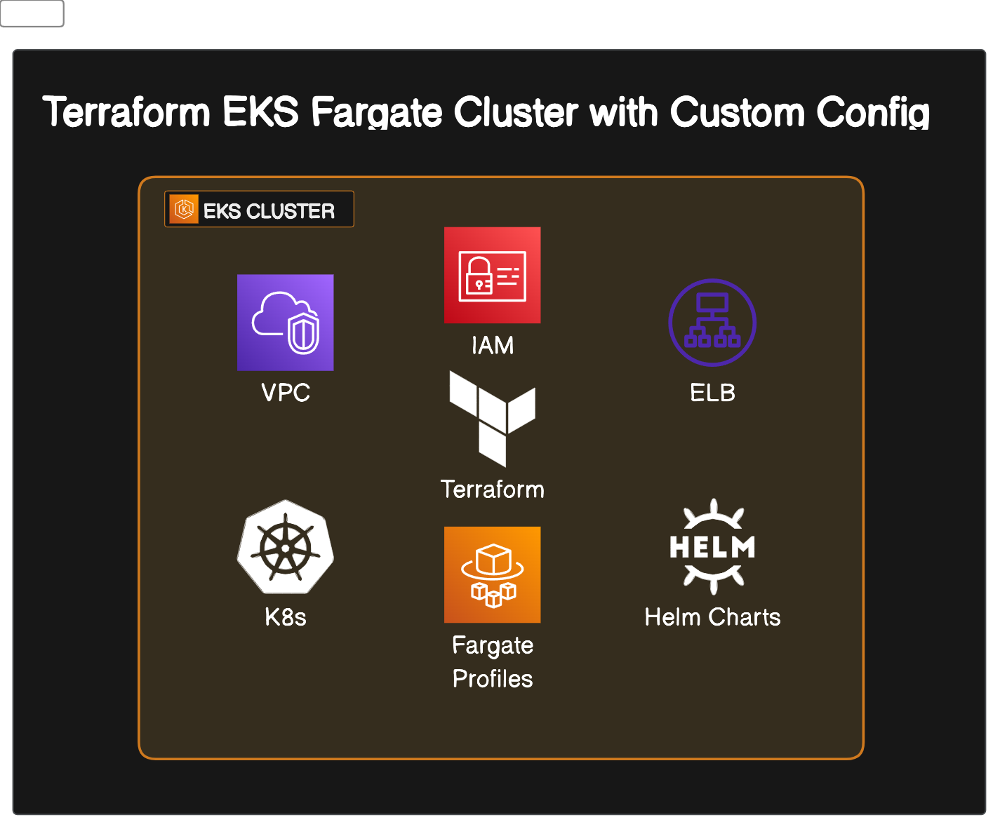

# EKS Fargate

This EKS Fargate cluster involves varities of AWS Services like **IAM Roles & Policies**, **VPC**, **Subnet**, **Route Tables**, **NAT Gateway**, **G Gateway**, **EKS**, **Fargate Profiles**, **OIDC Connector**, and **Helms charts** to install **ALB Controller** & **Metrics Server**.

