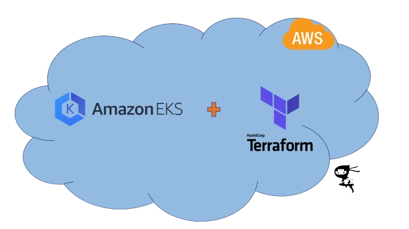

# Terraform-EKS

Say goodbye to tedious manual EKS configurations and hello to effortless cluster management with this comprehensive Terraform repository. Whether you favor the traditional control of EC2-based worker nodes or prefer the serverless convenience of Fargate, this toolkit has you covered.

## Documentation

This repo consist of various terraform code which is used to create an EKS cluster with varities of features like OIDC connector, Helms charts, monitoring, load balancer, custom vpc, and many more.

- [**EKS Cluster with EC2**](https://github.com/jadonharsh109/Terraform-EKS/tree/main/EKS%20EC2)

- [**EKS Cluster with Fargate**](https://github.com/jadonharsh109/Terraform-EKS/tree/main/EKS%20Fargate)

## Environment Variables

To run this project, you will need to add the following environment variables (AWS Credentials) to your **terraform.tfvars** file.

```
access_key = "<AWS_Access_Key>"
secret_key = "<AWS_Secret_Key>"
```

## Installation

Install my-project with npm

```bash
  terraform validate
  terraform plan
  terraform apply --auto-approve
```

## Tech Stack

**AWS:** EC2, EKS, ELB, IAM, VPC, Fargate.
